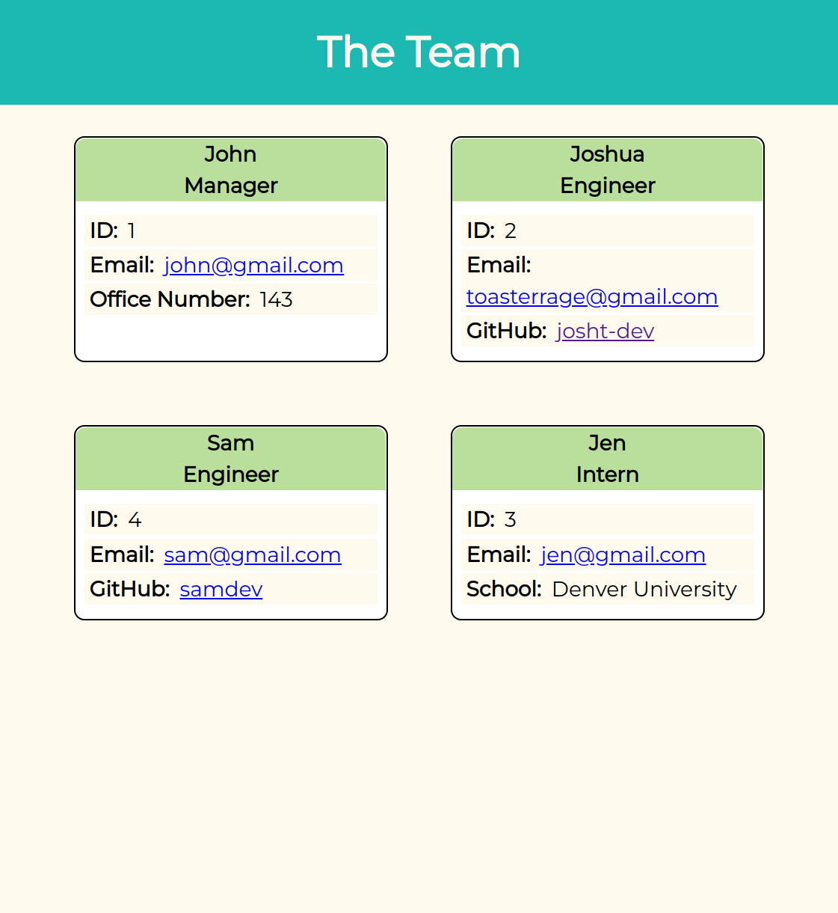

# wk10c-team-profile-generator

## Description

The application will dynamically generate a team profile page. It uses the jest module for testing and it I can see huge potential in test driven development with it. I also used several modules with classes that generate reusable objects that could be used for other projects later.

## Installation

- Clone the repo into your installation folder
- Open a terminal and navigate to your installation folder
- Run 'npm i' to install the required modules

## Usage

Opening a terminal into the application directory and running 'node index' will start the application. Follow the prompts to add all the members of your team and their required information. The application will generate the page for your team profile page. It will be saved in the 'dist' folder.

A video walkthrough of the application: https://drive.google.com/file/d/16EQ7VB65mc21HkrCsLU5uiFyr5cEkLzq/view

## Credits

N/A

## License

Refer to the LICENSE in the repo.
The font (Montserrat) is licensed under the SIL Open Font License (OFL).

## Tests

In a terminal, navigate to the application folder, then run 'npm test' to see the output of the JS test files.